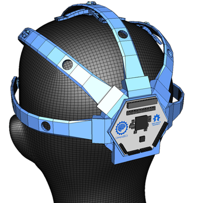
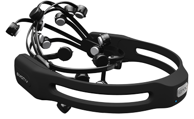

**Table of Contents**
{: #toc }
*  TOC
{:toc}

<!-- /.medium-4.columns -->

## Muse

The Muse headband is a easy to use EEG device with electrodes placed on Af7 and Af8 location if you are following 10-20 International Standards.

It is one of the easier bands to get started with if you are interested in learning eeg as it requires no head prep. Here are some simple projects you can get started with.

 <!-- end of row -->

#### No Programming Experience

These tools can be used to visualize your brain data:

* [View your brain activity by using Muses's Research Tools](http://developer.choosemuse.com/research-tools/getting-started)
* [View a live topographic map of your brain activity](http://www.brainavatar.com/ebrainavatar-muse.html)
* If you have an Android device, you can take a look at this [EEG 101 Tutorial](https://play.google.com/store/apps/details?id=com.eeg_project&amp;hl=en) which was made by some of the [NeuroTechX community members](https://github.com/NeuroTechX/eeg-101)

#### Some Programming Experience

These are open source projects which require some programming experience in order to implement them:

* [Introduction to Brain Computer Interfaces](https://github.com/bcimontreal/bci_workshop)
* [Using the Muse with Unity](http://developer.choosemuse.com/unity/getting-started)

## OpenBCI

The OpenBCI is an open source EEG that gives its user the opportunity to have maximum of 16 channels. Here are a variety of projects you can do.

 <!-- end of row -->

#### No Programming Experience

*  If you are not comfortable with EEGs or coding, we suggest taking a look at their Getting Started Guide. It includes a link to their [Visualizer software](http://docs.openbci.com/Getting%20Started/00-Welcome)
* This guide uses OpenVibe which is a dataflow programming system and is used for Brain Computer Interfaces. One of the NeuroTechX Community Members [built a P300 Speller using OpenBCI and OpenVibe](http://blog.jfrey.info/2015/02/04/openbci-p300-coadapt/)

#### Some Programming Experience

* [One of the OpenBCI Community members built an alphawave display](http://openbci.com/community/alphawave-openbci-based-demo/)

## Emotiv

The Emotiv Epoc is a 14 channel EEG which has a static form factor. This board is a good option for easy development and it only requires software experience. The major downside fo the Epoc is the cost and the fact that they charge you to get access to raw data.

 <!-- end of row -->

#### No Programming Experience

*  [Emotiv 3D Visualizer](https://www.emotiv.com/product/3d-brain-visualizer/)
* [You can also look at their apps and see if there is one that interests you](https://www.emotiv.com/product-category/applications/)

#### Some Programming Experience

* Emotiv has included links to a variety of Example scrips that can be used with the Emotiv. [They can be found here](https://github.com/Emotiv/community-sdk/tree/master/examples)
* This is a more complicated project and requires some software and hardware experience...and a wheel chair. [Check out this Emotiv controlled wheelchair](http://www.instructables.com/id/Brain-Controlled-Wheelchair/)

## NeuroSky

The Neurosky is one of the original consumer EEGs on the market. It is a 1 channel device and is only meant for simple use cases. Although some people have apparently built more complicated products with them.

 <!-- end of row -->

#### No Programming Experience

* [They have a quick start guide that you can use](http://developer.neurosky.com/docs/doku.php?id=mdt_quick_start_guide)
* [You can also get their visualizer for free](http://store.neurosky.com/products/brainwave-visualizer)

#### Some Programming Experience

* [NeuroSky has put together their own list of projects you can do with their devices](http://developer.neurosky.com/docs/doku.php?id=projects)

## No Headset

If you don't have a headset available, there are still some stuff you could do with Brain data. Check out some of these links.

* Want to contribute to open Neuroscience in a gamified way? [Check out Eyewire](http://eyewire.org/explore)
* You can also take a look at a buttload of MRI data [using Brainbox](http://brainbox.pasteur.fr/)

 <!-- end of content column -->

 <!-- end of row -->
