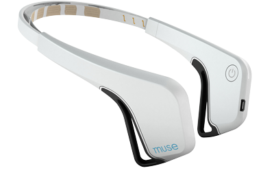
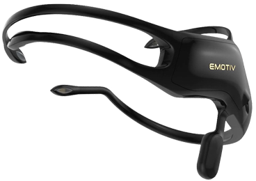
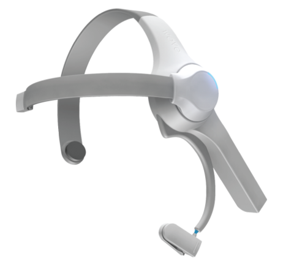

**Table of Contents**
{: #toc }
*  TOC
{:toc}

<!-- /.medium-4.columns -->

## Muse

Muse is an EEG device which has developed as a meditation device. It has 4 channels, 1 reference and two ground electrodes.

 <!-- end of row -->

#### Pros

* Easy to use SDK.
* Easy to wear
* Works well for doing resting state experiments
* Relatively cheap and has a 1 year warranty

#### Cons

* Limited to 4 channels
* Electrodes are not movable
* Not all head sizes will fit
* Difficult to do ERP experiments

## OpenBCI

The OpenBCI is an open source eeg and can go to a maximum of 16 channels. It was originally a 2013 Kickstarter project, but has expanded the original concept to include an opensouce 3D printed cap and will launch a 4 channel board in 2017.

 <!-- end of row -->

#### Pros

* Can go up to 16 channels
* 256 Hz Sampling Rate
* Modifiable to your own needs
* Can use your own electrodes
* Can add other inputs into the board
* Open Source (Hardware schematics and Software)
* Well Priced

#### Cons
* Higher Learning Curve
* Must print or get your own headset
* Must get your own electrodes

## Emotiv Epoc

T The Emotiv Epoc is one of the first consumeer eeg devices which was released on the market. The popularity of the company surged in 2012 and 2013, which can be reflected by its sales and number of DIY projects.

The Epoc is more stylish and easier to wear. It is also a popular device to use for EEG research as the cost is much better versus other research grade mobile EEG providers. However multiple people have complained that the provided electrodes are not very good.

 <!-- end of row -->

#### Pros

* Easy to put on.
* Good option for mobile eeg research
* Multiple apps to go along with the headset if you are into controlling things with your mind.

#### Cons

* The free SDK does not give you the raw data
* More Pricey
* The SDK is a little bit more clunky versus the alternatives and requires some technical experience
* Some people have complained about the electrodes not being high quality or not getting good contact

## Emotiv Insight

The Emoti Insight was the Section version of product with Emotiv brought the market. They positioned this product to be cheaper and a better option for people who don't want to spend too much money.

 <!-- end of row -->

#### Pros

* Cost is lower
* Design is sleek
* Easy to wear and use
* Uses Dry Electrodes

#### Cons

* The free SDK does not give you the raw data
* The SDK is a little bit more clunky versus the alternatives and requires some technical experience

## Neurosky Mindwave

The Neurosky is one of the original consumer eeg's to go to the market. It's product is design primarily to be toy like in nature and only has 1 channel.

 <!-- end of row -->

#### Pros

* Low cost
* Easy to wear and use
* Available SDK
* Uses Dry Electrodes

#### Cons

* Only 1 channel
* Can't move the electrode
* The SDK is a little bit more clunky versus the alternatives and requires some technical experience

 <!-- end of content column -->

 <!-- end of row -->

## Features Comparison <!-- table has its own row so that it can occupy whole width of page -->

| Device |	Channels | ADC Bits |	Sample Rate | Motion sensors |	LSL Support |	SD Card Support |	TTL |	Battery Length |	Cost (US) as of Jan 2017 |
|--------|-----------|----------|--------------|----------------|--------------|-----------------|-----|----------------|---------------------------|
| Muse 2016 |	4-6               |	12     |	256 Hz | 3 axis |	Yes      |	No             |	Maybe |	5 hours|	$200 |
| Epoc      |	14+2 ref          |	16 bit |	256 Hz | 9 axis |	Possible |	With accessory |	N/A   |	6 hours using BTLE |	$799 |
| Insight   |	5+2 ref           |	15 bit |	28 Hz  | 9 axis |	Possible |	With accessory |	N/A   |	4 hours using Blutooth |	$300 |
| OpenBCI   |	up to 16 channels |	24     |	250 Hz | 3 axis |	Yes      |	Yes            |	Yes   |	~26 hours |	$500 for 8 channels, $949 for 16 |
| Neurosky Mindwave |	1+1 ref   |	12     |	512Hz  | N/A    |	N/A      |	N/A            |	N/A   |	8 hours |	99.99 |

 <!-- end of table section -->
